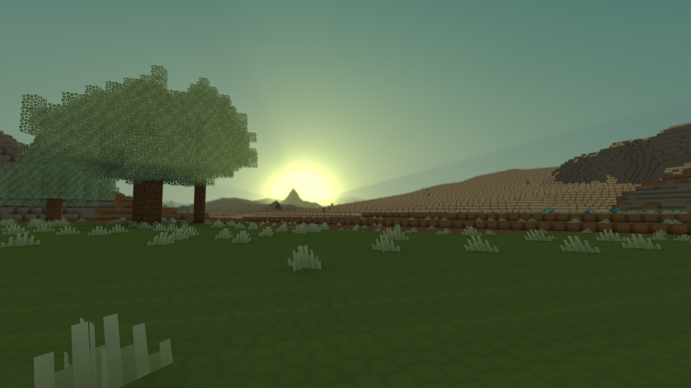
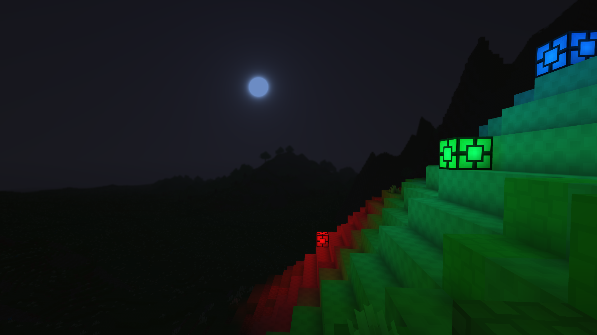

# Anothercraft - visualisation of a procedurally generated voxel terrain
A master thesis project. Basically a Minecraft clone, I was focusing on accelerating things on GPU. There is a master thesis text in the repository, however it is in Czech. There's also a first few chapters of the english master thesis translated, then I lost the drive. I might eventually document some of the techniques on a blog or something.

Feel free to get inspired by the code. I'd be glad if you noticed me if you intend to use the code, no real limitations from my side, though. I probably won't be continuing on this project unless I get paid :D

Used texture pack: C-tetra by canna (under CC BY-NC 4.0 licence); downloaded from https://www.planetminecraft.com/texture_pack/16x-c-tetra-1-13/

## Minimum requirements
* GPU with GL 4.5+ (+ some ARBs, basically 4.6), 2 GB VRAM (4+ GB recommended)
* 2 GB available RAM (4+ GB recommended)

## Videos & screenshots

[Video on Youtube](http://www.youtube.com/watch?v=M98Th82wC7c)

## Interesting technical stuff
1) Minecraft-like lighting system, but RGB and accelerated on GPU (light spread computing). Deferred shading. The way the model is designed results in a native ambient occlusion. (I'm sampling from a 3D light map texture, nodes are in centers of blocks, I offset the sampling position by half of the normal.
2) Block face aggergation. I am optimizing the rendered primitive count by aggregating neighbouring faces of blocks into one larger primitive. Calculation of this (together with calculation of which block faces are actually drawn) is done on GPU.
3) GPU-accelerated frustum culling.
4) Depth peeling (3 layers).
5) GPU-accelerated terrain generation. You program the generator on the CPU though (I have a wrapper for that). There are 2D/3D Perlin noise and Voronoi diagram thread cooperation shaders implemented. The generation is however quite slow, loading from a disc is like 10x faster and does not lag the game.
6) Even though a lot of stuff is accelerated on the GPU, you can still have custom block shapes and have practically a full control from CPU.
7) You can go to view distances up to 64 chunks and it still works quite well if you have a decent graphics card (you'll need 6 GB of VRAM for that though).
8) Memory requirements: 4 B per block on both RAM and VRAM. Chunk size is the same as in Minecraft.
9) I'm storing the save game in a SQLite database, which works quite well (compressed with zlib).

## How to build
There are Windows x64 and x86 binaries in the repository. It should compile on Linux, however there seems to be some problems.

1) Install a D compiler (preferably `dmd`, http://dlang.org, `sudo apt-get install dmd-compiler`)
2) (Already done for you for Windows) Download appropriate CSFML binaries from https://www.sfml-dev.org/download/csfml/ (version 2.4; or build them, whatever makes you comfy).
3) (Already done for you for Windows) Put the shared libraries in the bin_XX folder & the static libraries in the lib_XX folder  (the XX is for example x86, x86_64 or so depending on the architecture).
4) (Already done for you for Windows) Download official sqlite3 binaries, put the dll in the bin_XX folder. For windows, generate .lib file to the lib_xx folder from the .dll using the implib tool downloaded here: https://digitalmars.com/download/freecompiler.html (basic utilites); command: `implib /system sqlite3.lib sqlite3.dll` ( https://digitalmars.com/ctg/implib.html ). Alternatively, you can download it from here: https://github.com/buggins/ddbc/tree/master/libs (Also already present for windows)
5) Run `dub build --build=release --arch=x86_64` (or without the `--arch=x86_64` for x86 build) in the root project folder (where dub.sdl is)
6) A binary should appear in the bin_XX folder